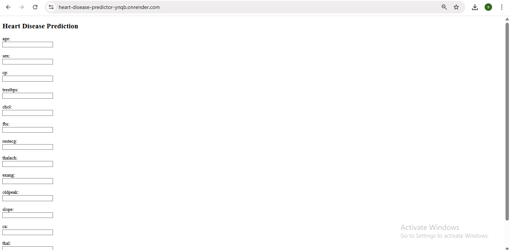
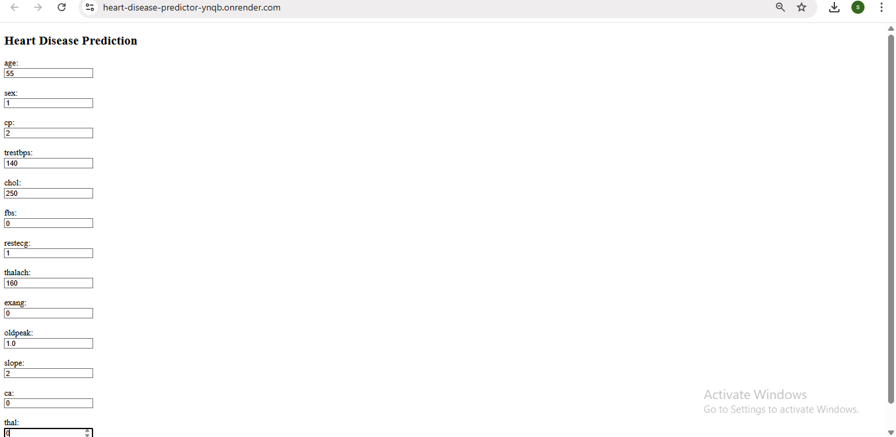
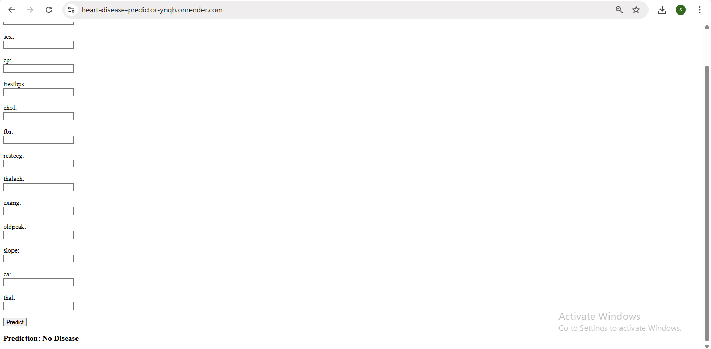

# heart-disease-predictor

This project is a Flask-based web application that predicts the presence of heart disease in patients using clinical data such as age, cholesterol, blood pressure, and more. It leverages a Gradient Boosting Classifier, an ensemble machine learning technique known for its high accuracy on structured data.

---

## Features

- Takes user input like age, sex, cholesterol, blood pressure, and ECG results.
- Uses 13 clinical features commonly linked to heart health.
- Converts the condition column to binary: 0 (No Disease), 1 (Disease).
- Trained using a Gradient Boosting Classifier for high prediction accuracy.
- Displays a clear result: either “No Disease” or “Disease” based on input.


---

## Prerequisites

Make sure the following are installed:

- Python 3.7 or higher installed
- Git installed and configured
- Basic knowledge of Python and Flask
- A GitHub account (for code hosting)
- Render account (for deployment)

---

## Installation

### 1. Clone the repository

```
git clone https://github.com/sandhiya0147/heart-disease-predictor.git
cd heart-disease-predictor

```

### 2. Install dependencies

```
pip install -r requirements.txt
```

---

## Running the Application

Start the Flask development server:

```
python app.py
```

Then open your browser and go to:

```
http://127.0.0.1:5000
```

---

## How It Works

- User enters clinical details (like age, cholesterol, chest pain, etc.) through a web form.
- The Flask app collects the input and arranges it in the format expected by the model.
- The pre-trained Gradient Boosting model processes the input features.
- The model predicts if the patient is at risk of heart disease (0 = No, 1 = Yes).
- The result is displayed clearly on the screen: “No Disease” or “Disease.”

---

## File Structure

```
heart-disease-predictor/
├── static/
│   └── style.css
├── templates/
│   └── index.html
├── heart.csv
├── model_train.py
├── model.pkl
├── feature_columns.pkl
├── target_names.pkl
├── app.py
├── requirements.txt
├── Procfile
└── README.md          
```

---

## Future Improvements

- Add more data sources or real-time data integration from wearable devices.
- Improve prediction confidence by showing probability scores alongside results.
- Integrate user authentication to store and track individual health records.
- Visualize patient risk factors using interactive charts or graphs.
- Deploy a mobile-friendly version with responsive UI for better accessibility.

---


## Step-by-Step Guide: How to Use the Movie Interest Predictor


### Step 1: Input Form
  

### Step 2: Filled Form 
  

### Step 3: Prediction Result


---

## Live Demo

[Click here to view the deployed app](https://heart-disease-predictor-ynqb.onrender.com)

---
